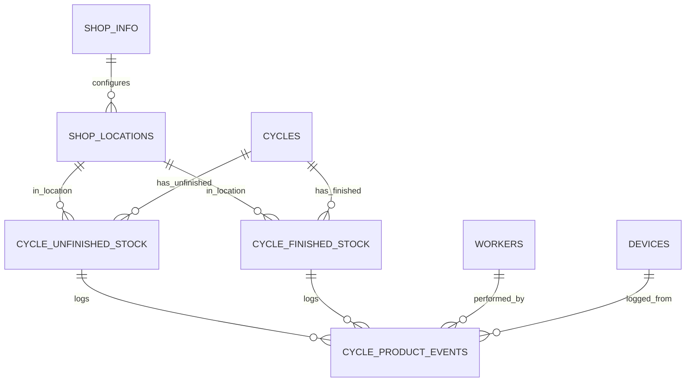

# StockLens Cycle: Database Architecture (CSV to DB)

## 1) Current server behavior (what exists now)

Data is currently file-based under `shared/data/stock/`:

- `brands.csv`: master stock sheet + metadata lines (title/subtitle/date)
- `cycle.csv`: cycle list (`StartDate`, `EndDate`, `Status`)
- `cycles/<YYYY-MM-DD>.csv`: per-cycle product rows + unfinished/finished/match logs
- `worker.csv`: operator list
- `bestselling.csv`: fast-moving products

Main logic is in `server/routes/cycle.js`.

Important note from analysis:
- `POST /api/cycle/:date/product` is declared twice in `server/routes/cycle.js:2963` and `server/routes/cycle.js:4717` (second handler effectively wins in Express registration order).

## 2) Target architecture

Use SQLite as source of truth, keep API contracts mostly unchanged.

Layers:

1. API layer (existing routes)
2. Service layer (cycle workflow rules, matching logic, validation)
3. Repository layer (SQL transactions)
4. Background jobs:
   - import master sheet (brands)
   - optional CSV export (for backup/legacy compatibility)

## 3) Proposed tables (single-shop DB + dynamic locations)

Because you run one database per shop (7 shops = 7 DBs), this schema has no cross-shop `shop_id` foreign keys.

### Shop metadata

1. `shop_info`
- Purpose: metadata for this database (single shop only)
- Key fields:
  - `id` (PK, fixed value `1`)
  - `shop_code` (unique)
  - `shop_name`
  - `area_name`
  - `city`
  - `state`
  - `pincode`
  - `address_line1`
  - `address_line2` (nullable)
  - `nil_location` (FK -> `shop_locations.id`)
  - `active`
  - `created_at`, `updated_at`

2. `shop_locations`
- Purpose: dynamic stock tabs/locations in this shop DB (example: `shop`, `godown`, `bar`, `warehouse_2`)
- Key fields:
  - `id` (PK)
  - `location_code` (lowercase unique key)
  - `location_name` (display label)
  - `location_type` (optional: `retail`, `warehouse`, etc.)
  - `sort_order`
  - `active`
  - `created_at`, `updated_at`
- Constraints:
  - unique (`location_code`)

### Master data

### Cycle state

3. `cycles`
- Purpose: cycle master (`cycle.csv`)
- Key fields:
  - `id` (PK)
  - `sno` (legacy serial)
  - `start_date` (unique)
  - `end_date`
  - `status` (`active|inactive`)
  - `created_at`, `updated_at`

4. `cycle_unfinished_stock`
- Purpose: working table for in-progress scan data
- Row granularity: one row per `cycle + item_code + location + activity_date`
- Key fields:
  - `id` (PK)
  - `cycle_id` (FK -> `cycles.id`)
  - `item_code` (from source file `Code`, text)
  - `item_name`
  - `brand_name`
  - `pack_value`
  - `bpc`
  - `mrp`
  - `barcode`
  - `shop_location_id` (FK -> `shop_locations.id`)
  - `activity_date`
  - `quantity_bottles`
  - `is_matched` (bool)
  - `current_stock_bottles`
  - `diff_bottles`
  - `recheck_shown` (bool)
  - `last_updated_by_worker_id` (FK -> `workers.id`, nullable)
  - `state_updated_at`
  - `created_at`, `updated_at`
- Constraints:
  - unique (`cycle_id`, `item_code`, `shop_location_id`, `activity_date`)

5. `cycle_finished_stock`
- Purpose: finalized rows after finish action ("moved from unfinished")
- Row granularity: one row per `cycle + item_code + location + activity_date`
- Key fields:
  - `id` (PK)
  - `cycle_id` (FK -> `cycles.id`)
  - `item_code` (from source file `Code`, text)
  - `item_name`
  - `brand_name`
  - `pack_value`
  - `bpc`
  - `mrp`
  - `barcode`
  - `shop_location_id` (FK -> `shop_locations.id`)
  - `activity_date`
  - `quantity_bottles`
  - `is_matched` (bool)
  - `matched_at`
  - `last_updated_by_worker_id` (FK -> `workers.id`, nullable)
  - `finished_at`
  - `finished_by_worker_id` (FK -> `workers.id`, nullable)
  - `source_unfinished_id` (FK -> `cycle_unfinished_stock.id`, nullable for backfill)
  - `created_at`, `updated_at`
- Constraints:
  - unique (`cycle_id`, `item_code`, `shop_location_id`, `activity_date`)

6. `cycle_product_events`
- Purpose: append-only event log (replaces JSON arrays in `ChangeLog` and `UnfinishedChangeLog`)
- Key fields:
  - `id` (PK)
  - `cycle_id` (FK -> `cycles.id`)
  - `item_code` (text)
  - `item_name`
  - `brand_name`
  - `pack_value`
  - `shop_location_id` (FK -> `shop_locations.id`)
  - `cycle_unfinished_id` (FK -> `cycle_unfinished_stock.id`, nullable)
  - `cycle_finished_id` (FK -> `cycle_finished_stock.id`, nullable)
  - `activity_date`
  - `event_time`
  - `event_scope` (`unfinished|finished`)
  - `event_action` (`added|updated|created|modified|deleted|matched`)
  - `matched` (bool)
  - `stock_bottles_after`
  - `current_stock_bottles`
  - `diff_bottles`
  - `changes_json` (JSONB)
  - `worker_id` (FK -> `workers.id`, nullable)
  - `device_id` (FK -> `devices.id`, nullable)
  - `shop_name`
  - `phone_name`
  - `created_at`

### Supporting data

7. `workers`
- Purpose: operator directory (`worker.csv`)
- Key fields:
  - `id` (PK)
  - `name` (case-insensitive unique)
  - `phone`
  - `active`
  - `created_at`, `updated_at`

8. `devices`
- Purpose: normalized device metadata from scan logs
- Key fields:
  - `id` (PK)
  - `uuid` (unique)
  - `model`
  - `platform`
  - `created_at`, `updated_at`

9. `best_selling_products`
- Purpose: curated fast-moving list (`bestselling.csv`)
- Key fields:
  - `id` (PK)
  - `item_code` (text)
  - `item_name`
  - `brand_name`
  - `pack_value`
  - `priority` (optional order)
  - `active`
  - `created_at`
- Constraints:
  - unique (`item_code`)

10. `app_settings`
- Purpose: replace config text fields used by API (`required_build`, print options, etc.)
- Key fields:
  - `id` (PK)
  - `key`
  - `value`
  - `updated_at`
- Constraints:
  - unique (`key`)

## 4) ER diagram (Mermaid)

## 5) Migration plan

1. Create SQLite schema per shop database.
2. Seed one `shop_info` row and configure `shop_locations`.
3. For existing data, create default locations:
- `shop`
- `godown`
4. Build one-time importers for:
- `brands.csv` -> seed cycle snapshot rows (item fields + location target values)
- `cycle.csv` -> `cycles`
- `cycles/*.csv` -> `cycle_unfinished_stock`, `cycle_finished_stock`, `cycle_product_events`
- `worker.csv` -> `workers`
- `bestselling.csv` -> `best_selling_products`
5. Switch read APIs to DB first (`/api/cycle/:date`, `/api/cycle/:date/compare`, `/api/operators`, `/api/bestselling`).
6. Switch write APIs (`/api/cycle/:date/product`, `/api/cycle/:date/finish`, `/api/cycle/start`, `/api/cycle/stop`) using SQL transactions.
7. Keep optional CSV export for rollback window, then retire CSV writes.

## 6) Implementation notes

- Store stock quantities as integer bottles and format as `cases.bottles` in API responses.
- Never hardcode `shop/godown` in schema or logic. Always use `shop_location_id`.
- `item_code` must be treated as text (not numeric) to avoid format loss from values like `508.1`.
- Because there is no separate `products` table, keep product metadata snapshot columns (`item_name`, `brand_name`, `pack_value`, `bpc`, `mrp`, `barcode`) in cycle tables.
- Nil stock config is in `shop_info.nil_location` as one `shop_locations.id`.
- Add indexes:
  - `cycles(status, start_date)`
  - `shop_locations(location_code)`
  - `cycle_unfinished_stock(cycle_id, item_code, shop_location_id, activity_date)`
  - `cycle_finished_stock(cycle_id, item_code, shop_location_id, activity_date)`
  - `cycle_product_events(cycle_id, item_code, shop_location_id, event_time)`
- Use row-level locking (`FOR UPDATE`) in save/finish transactions to avoid race conditions from concurrent scanners.
- Finish flow (single transaction):
  - lock unfinished row by (`cycle_id`, `item_code`, `shop_location_id`, `activity_date`)
  - upsert into `cycle_finished_stock`
  - insert `finished` event into `cycle_product_events`
  - delete row from `cycle_unfinished_stock`
